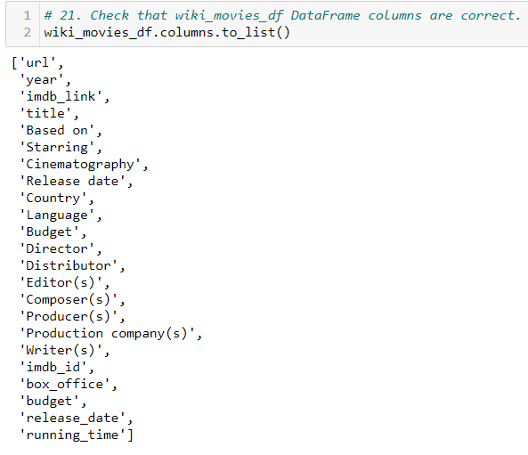
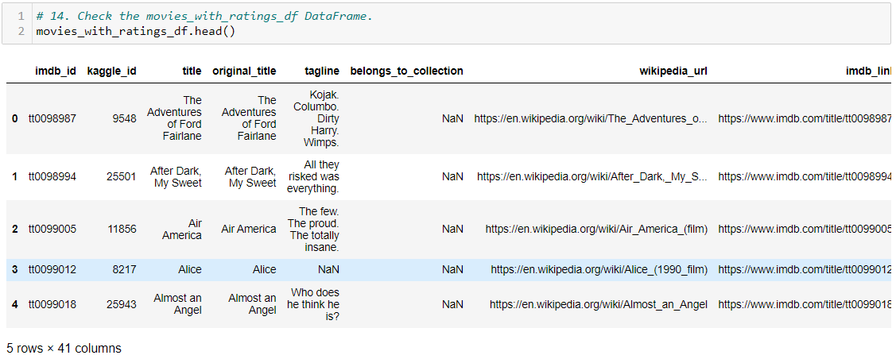
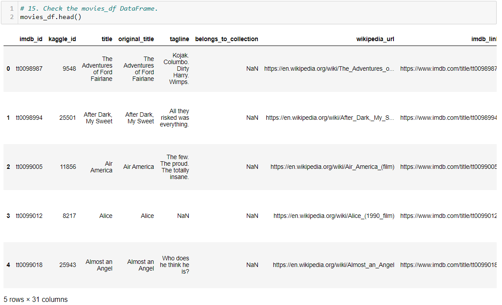
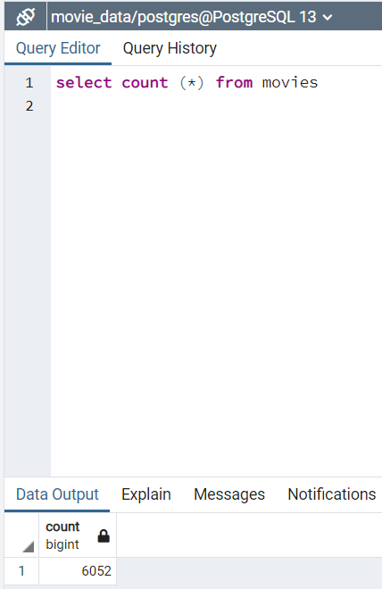

# Movies-ETL
Module 8

## Overview of Analysis

Amazing Prime wants to keep the dataset and updated on a daily basis. I've been asked to create an automated pipeline that takes in new data, performs the appropriate transformations, and loads the data into existing tables. I’ll need to refactor the code from module 8 to create one function that takes in the three files—Wikipedia data, Kaggle metadata, and the MovieLens rating data—and performs the ETL process by adding the data to a PostgreSQL database.

## Resources:

Data Source: 
- [movies_metadata.csv](Resources/movies_metadata.csv) 
- [wikipedia-movies.json](Resources/wikipedia-movies.json) 
- ratings.csv
 
Software: PostgreSQL v13.3, pgAdmin 4 v5.3, Jupyter Notebook, Anaconda 4.10.1, Python 3.7.6, Visual Studio Code, 1.56.0
 
Code: 	
- [ETL_function_test.ipynb](ETL_function_test.ipynb) 
- [ETL_clean_wiki_movies.ipynb](ETL_clean_wiki_movies.ipynb) 
- [ETL_clean_kaggle_data.ipynb](ETL_clean_kaggle_data.ipynb) 
- [ETL_create_database.ipynb](ETL_create_database.ipynb) 

## Results: ETL_function_test

## Results: ETL_clean_wiki_movies

## Results: ETL_clean_kaggle_data

## Results: ETL_create_database

## Summary

I have created the below deliverables for Amazing Prime.They will now be able to keep the dataset and update on a daily basis for years to come.